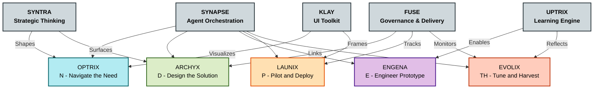

# 🗺 STRATOS Framework & Agent Map

This map outlines how STRATOS organizes modular intelligence, front-end tooling, execution logic, and learning loops.

---

## 🧠 Core Frameworks

| Name     | Function |
|----------|----------|
| **SYNAPSE** | Agent orchestration and co-pilot execution |
| **SYNTRA**  | Strategic synthesis and idea traction system |
| **FUSE**    | Governance, workflow design, delivery management |
| **UPTRIX**  | Learning, reflexive growth, and capability tracking |
| **KLAY**    | UI generation and branding toolkit |

---

## 🤖 Co-Pilot Agents (via SYNAPSE)

| Agent    | Phase | Role |
|----------|-------|------|
| **OPTRIX** | N | Opportunity Mapping |
| **ARCHYX** | D | Solution Architecture |
| **ENGENA** | E | Automation Engineering |
| **LAUNIX** | P | Deployment Strategy |
| **EVOLIX** | TH | Improvement and Scaling |

---

## 🗺 STRATOS System Map

---

> Frameworks think, agents act — STRATOS connects both.
