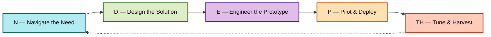

# 🌀 N-DEPTH Lifecycle – SYNAPSE Execution Model

The **N-DEPTH Lifecycle** is the backbone of SYNAPSE — a strategic flow that turns friction into transformation and transformation into intelligent systems. Each phase is designed to anchor specific co-pilot actions, outputs, and reuse logic.

---

## 🔁 Lifecycle Phases

| Phase | Stands For            | Description |
|-------|------------------------|-------------|
| **N** | Navigate the Need      | Identify key signals, friction points, or transformation drivers worth exploring. |
| **D** | Design the Solution    | Map solution blueprints, data flows, and modular architecture based on identified needs. |
| **E** | Engineer the Prototype | Build and test the first working iteration — a lightweight MVP or tool. |
| **P** | Pilot & Deploy         | Roll out the solution for initial usage, feedback, or team adoption. |
| **TH**| Tune & Harvest         | Improve based on real usage, capture insights, and prepare for versioning or scaling. |

---

## 📊 Visual Flow

---

> Each phase is modular — yet designed for momentum. N-DEPTH ensures that ideas don’t just get built — they evolve, adapt, and deliver measurable outcomes.

---
