# 🧭 STRATOS Ecosystem Overview

STRATOS is a modular transformation operating system designed to orchestrate frameworks, agents, and knowledge systems into a coherent and scalable digital enablement stack.

---

## 🧱 Core Pillars

| Component | Description |
|----------|-------------|
| [SYNAPSE](https://github.com/hadzwanihasni/synapse) | Modular co-pilot agent engine |
| [KLAY](https://github.com/hadzwanihasni/klay-ui) | UI/UX co-pilot and layout system |
| [SYNTRA](https://github.com/hadzwanihasni/syntra) | Synthesis and traction thinking system |
| [BLOM](https://github.com/hadzwanihasni/blom) | Signal intelligence and insight scout |
| [RIDEPLANR](https://github.com/hadzwanihasni/rideplanr) | Contextual assistant (weather + routing demo) |

---

## 🔁 N-DEPTH Lifecycle Alignment

| Phase | Function | Co-Pilot |
|-------|----------|----------|
| **N** | Navigate the Need | OPTRIX, BLOM |
| **D** | Design the Solution | ARCHYX, SYNTRA |
| **E** | Engineer Prototype | ENGENA, KLAY |
| **P** | Pilot and Deploy | LAUNIX |
| **TH**| Tune & Harvest | EVOLIX |

---

## 🔄 STRATOS Modular Orchestration – Diagram

```mermaid
graph TD
    STRATOS["🌀 STRATOS<br/>Strategic Operating System for Transformation, Orchestration & Scale"]

    %% Core Pillars
    STRATOS --> SYNAPSE["🧠 SYNAPSE<br/>Agent Engine"]
    STRATOS --> SYNTRA["🧩 SYNTRA<br/>Strategic Thinking"]
    STRATOS --> KLAY["🎨 KLAY<br/>UI/UX Toolkit"]
    STRATOS --> BLOM["🌱 BLOM<br/>Signal Scout"]
    STRATOS --> RIDEPLANR["🧭 RIDEPLANR<br/>Contextual Assistant"]

    %% Lifecycle Mapping
    SYNAPSE --> OPTRIX["🔎 OPTRIX (N)"]
    SYNAPSE --> ARCHYX["🧠 ARCHYX (D)"]
    SYNAPSE --> ENGENA["🛠️ ENGENA (E)"]
    SYNAPSE --> LAUNIX["🚀 LAUNIX (P)"]
    SYNAPSE --> EVOLIX["📈 EVOLIX (TH)"]

    %% Phase Mapping
    BLOM --> OPTRIX
    SYNTRA --> ARCHYX
    KLAY --> ENGENA

    %% Styling: High contrast text colors
    style STRATOS fill:#f5f5f5,stroke:#263238,stroke-width:2px,color:#000
    style SYNAPSE fill:#b2ebf2,stroke:#006064,stroke-width:2px,color:#000
    style SYNTRA fill:#dcedc8,stroke:#33691e,stroke-width:2px,color:#000
    style KLAY fill:#f8bbd0,stroke:#880e4f,stroke-width:2px,color:#000
    style BLOM fill:#d7ccc8,stroke:#4e342e,stroke-width:2px,color:#000
    style RIDEPLANR fill:#ffe082,stroke:#ff6f00,stroke-width:2px,color:#000

    style OPTRIX fill:#e0f7fa,color:#000
    style ARCHYX fill:#e8f5e9,color:#000
    style ENGENA fill:#f3e5f5,color:#000
    style LAUNIX fill:#fff3e0,color:#000
    style EVOLIX fill:#ffebee,color:#000
```

---

## 📂 Core Docs

- [Roadmap](./roadmap.md)  
- [Glossary](./docs/glossary.md)  
- [Framework Map](./docs/framework-map.md)  
- [Lifecycle (N-DEPTH)](./docs/n-depth.md)

---

> STRATOS is where ideas become infrastructure.
