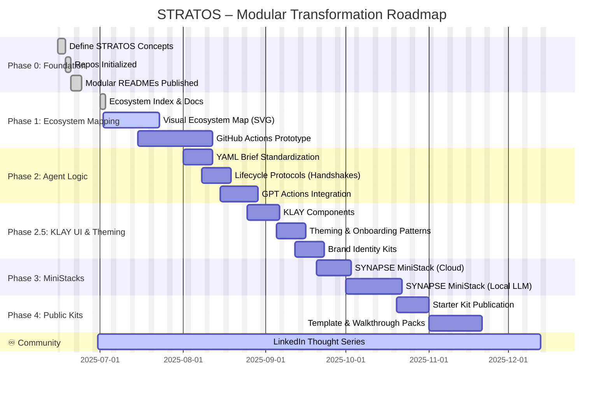

# 🚀 STRATOS – Roadmap & System Maturation

> *“From orchestrated systems to intelligent outcomes — STRATOS evolves modularly.”*

---

## ✅ Phase 0: Foundation (Complete)
- [x] STRATOS name, ecosystem concept, and lifecycle model defined  
- [x] Initial GitHub repositories created: `synapse`, `syntra`, `klay-ui`, `blom`  
- [x] Modular README anchors published  

---

## 🔄 Phase 1: Ecosystem Mapping (In Progress)
- [x] Ecosystem `index.md` established  
- [x] Docs folder scaffolded  
- [ ] Visual ecosystem map (SVG)  
- [ ] STRATOS GitHub Actions prototype  

---

## 🧠 Phase 2: Agent Modularity & Prompt Logic (Planned)
- [ ] YAML brief standardization across all agents  
- [ ] Agent lifecycle orchestration protocols (handshakes)  
- [ ] GPT Actions integration  
- [ ] Agent logic interface unification (`SYNAPSE`)  

---

## 🎨 Phase 2.5: KLAY UI & Theming (Design-First Shift)
> **Moved earlier to prevent future UI refactoring.**
- [ ] KLAY theming system (color, layout, typography)  
- [ ] Onboarding interface and component kit  
- [ ] Markdown/Streamlit-ready UI patterns  
- [ ] Branding system for STRATOS Lite  

---

## 🧪 Phase 3: MiniStacks (Execution Layer)
- [ ] SYNAPSE MiniStack (Cloud – GPT Actions + GitHub logic)  
- [ ] SYNAPSE MiniStack (Local – Ollama + LangGraph + Streamlit)  
- [ ] Example workflows and orchestration simulation  

---

## 📘 Phase 4: Public Kits & Ecosystem Assets
- [ ] STRATOS Starter Kit (PDF / Markdown edition)  
- [ ] STRATOS Template Pack (agent briefs, flowcharts, UI blocks)  
- [ ] Ecosystem learning walkthrough (interactive README)  

---

## ♾️ Continuous Track: Community & Thought Leadership
> This track runs **parallel to all phases**, supporting storytelling, adoption, and contribution.

- [x] LinkedIn Thought Series – *SYNAPSE Origin to Ecosystem*  
- [ ] GitHub Discussions enabled for each module  
- [ ] Medium/GitHub blog deep-dives on design decisions  
- [ ] Community Remix Kit (fork-ready)  

---

## 📊 Strategic Development View

---

>“STRATOS doesn’t just manage transformation — it makes it modular, intelligent, and ready to scale.”

*Last updated: 2025-07-02*
